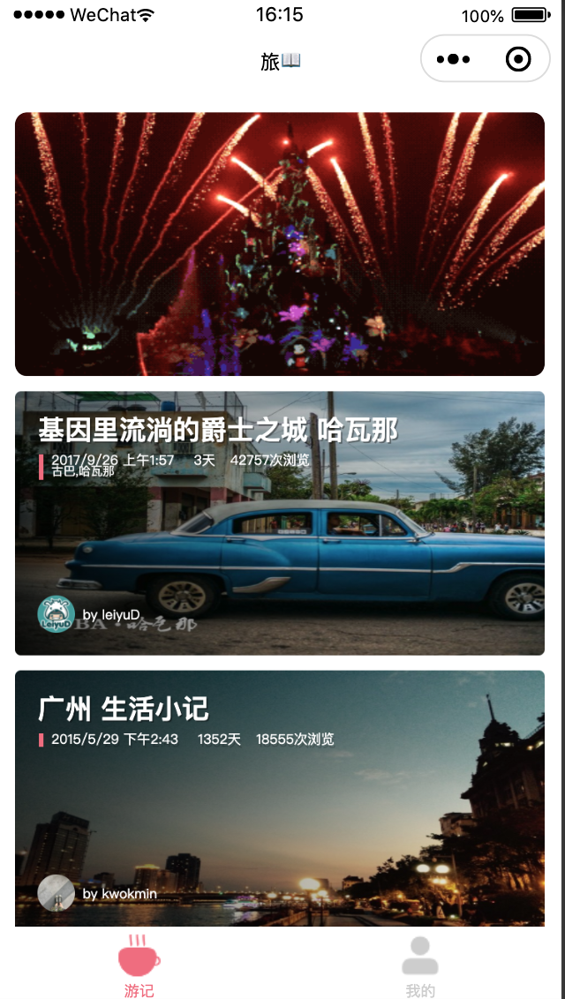
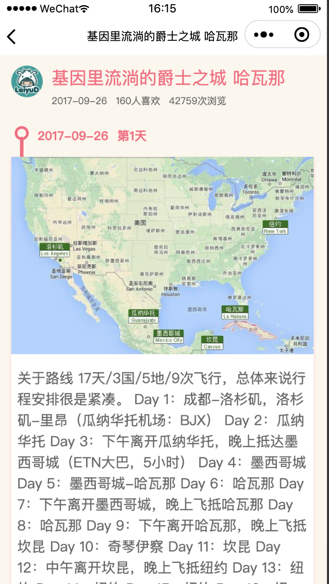
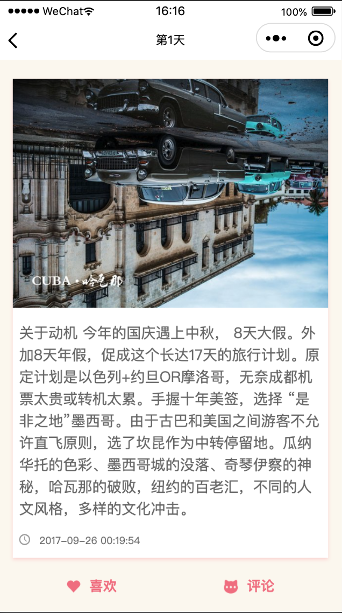
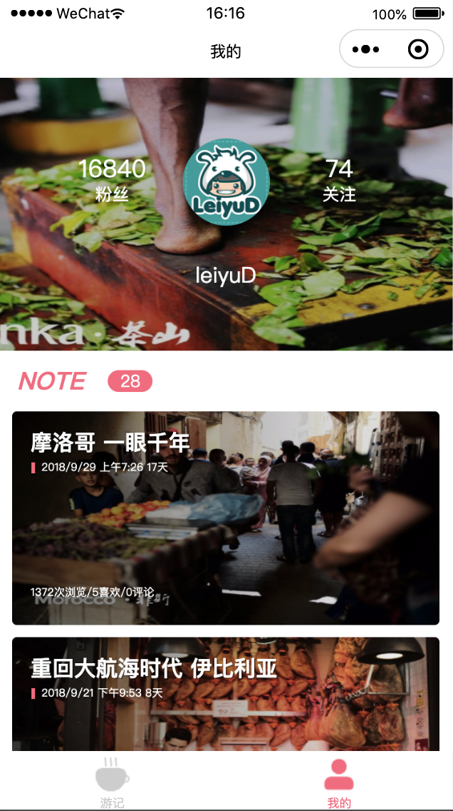

# 技术栈

React + Taro + Dva + Sass + ES6/ES7 + TypeScript

## 适配进度

- [x] 微信小程序 -- 已适配
- [x] H5 -- 已适配

## 预览

<figure>

</figure>

<!--  -->

# 文档

- [Taro开发文档](https://nervjs.github.io/taro/docs/README.html)
- [Dva开发文档](https://dvajs.com/)
- [小程序开发文档](https://mp.weixin.qq.com/debug/wxadoc/dev/)
- [Mock使用文档](https://github.com/nuysoft/Mock/wiki/Getting-Started)

# License

[MIT](LICENSE)
